# Serverless Document Processing Pipeline

A fully serverless, event-driven document processing pipeline built on AWS. The system automatically processes documents when they are uploaded, stores the processing results, and provides a web interface to retrieve processed files.

The project uses AWS managed services with no continuously running server infrastructure.

---

## Architecture


### Architecture Flow

```text
User
  |
  v
Frontend (S3)
  |
  | Request upload URL
  v
API Gateway
  |
  v
Lambda
(Presigned URL)
  |
  | Secure direct upload
  v
S3 Upload Bucket
  |
  | S3 Event
  v
Lambda
(Document Processing)
  |
  +--------------------+
  |                    |
  v                    v
Textract            DynamoDB
(OCR)               (Results)
                       
Failure Path:
Lambda
  |
  v
SQS Dead-Letter Queue
  |
  v
CloudWatch Alarm
  |
  v
Email Notification
```

---

## Demo

[▶️ Watch the Upload Demo](screenshots/upload-demo.mov)

---

## What the Project Does

The pipeline automatically processes documents as soon as they are uploaded.

### Workflow

1. A user uploads a file through the web frontend.
2. The frontend requests a secure, time-limited upload URL from a Lambda function.
3. Lambda generates an Amazon S3 presigned URL.
4. The browser uploads the file directly to S3 using the presigned URL.
5. The S3 upload automatically triggers the document processing Lambda function.
6. The Lambda function reads the uploaded file metadata.
7. The document is processed through the Amazon Textract integration point.
8. The processing result and file metadata are stored in DynamoDB.
9. The frontend uses API Gateway to retrieve the processed results.
10. If processing fails, the event is captured by an SQS dead-letter queue.
11. CloudWatch monitors the failure path and sends an email notification when the configured alarm is triggered.

---

## AWS Services Used

| Service | Purpose |
|---|---|
| Amazon S3 | Stores uploaded documents and hosts the frontend |
| AWS Lambda | Provides serverless application logic |
| Amazon Textract | OCR and document text extraction |
| Amazon DynamoDB | Stores document metadata and processing results |
| Amazon API Gateway | Provides HTTP endpoints for the frontend |
| Amazon SQS | Provides the dead-letter queue for failed processing |
| Amazon CloudWatch | Monitoring, logging, and failure alarms |
| AWS IAM | Controls access between AWS services |
| Terraform | Infrastructure as Code |
| Python | Lambda function implementation |

---

## Architecture Components

### Amazon S3

Two S3 buckets are used:

- **Upload bucket** - stores documents submitted for processing.
- **Frontend bucket** - hosts the static web frontend.

The upload bucket is configured to trigger the document-processing Lambda whenever a new file is uploaded.

---

### AWS Lambda

The project uses three Lambda functions.

#### 1. Generate Upload URL

Generates a secure, temporary S3 presigned URL that allows the browser to upload a file directly to S3.

#### 2. Process Document

Triggered by an S3 upload event.

The function:

- Reads the uploaded file metadata.
- Processes the document.
- Integrates with the Textract processing point.
- Stores the result in DynamoDB.

#### 3. Get Results

Exposed through API Gateway and used by the frontend to:

- Retrieve processing results.
- List recently processed files.

---

### Amazon Textract

Amazon Textract is used as the OCR integration for extracting text from uploaded documents.

During development, the AWS account had a service-plan restriction that prevented direct Textract usage.

The integration point was therefore temporarily replaced with a mock response while the rest of the pipeline was developed and tested.

```python
# In production, this line calls Textract:
# response = textract.detect_document_text(
#     Document={'S3Object': {'Bucket': bucket, 'Name': key}}
# )

extracted_text = "mock: OCR integration point (Textract pending account plan upgrade)"
```

---

## Why These Services Were Chosen

### Lambda Instead of EC2

Document processing is bursty because processing only occurs when a document is uploaded.

Lambda runs only when required and automatically scales when multiple files are processed.

An EC2-based architecture would require a running server even when there are no documents to process.

---

### DynamoDB Instead of RDS

The application primarily performs simple key-value operations such as:

- Storing a result using `file_id`
- Retrieving a result using `file_id`
- Listing recently processed documents

No relational joins are required, making DynamoDB suitable for this access pattern.

---

### Presigned URL Instead of Uploading Through Lambda

The browser uploads files directly to S3 using a temporary presigned URL.

```text
Browser
   |
   | Request upload URL
   v
API Gateway
   |
   v
Lambda
   |
   | Generate presigned URL
   v
Browser
   |
   | Direct upload
   v
S3
```
---

# Build Walkthrough

## 1. IAM User

A scoped IAM user was created for building and managing the project instead of using the AWS root account.

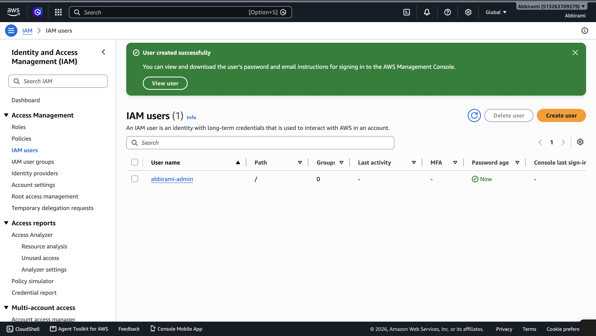

---

## 2. S3 Buckets

Two S3 buckets were created:

- Upload bucket
- Frontend bucket

The upload bucket is private and configured to trigger document processing.

The frontend bucket hosts the static web interface.

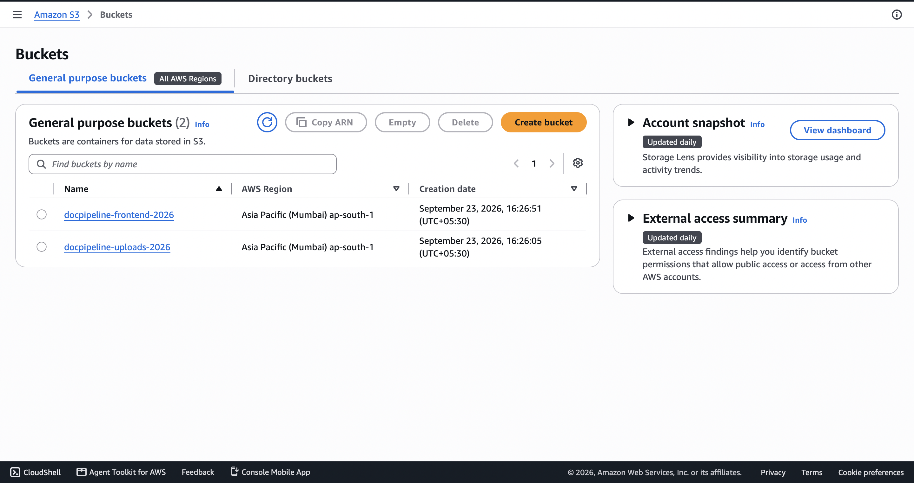

---

## 3. DynamoDB Table

A DynamoDB table named `docpipeline-results` was created with:

- Partition key: `file_id`
- Billing mode: On-Demand

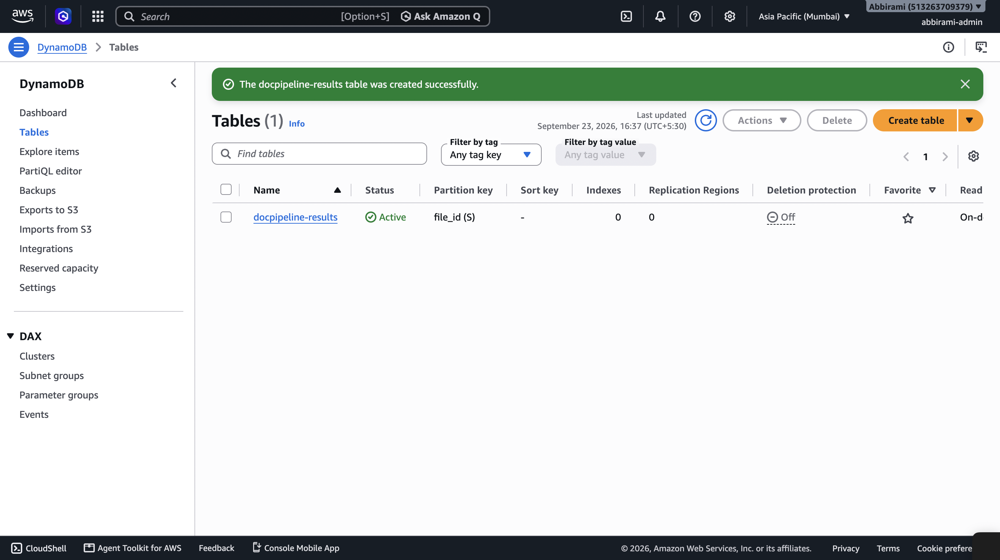

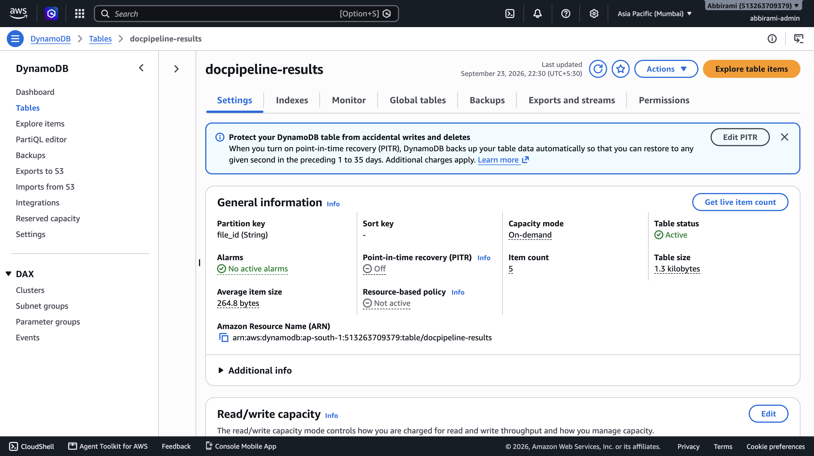

---

## 4. IAM Role for Lambda

An IAM execution role was created for Lambda with permissions required to interact with:

- S3
- Textract
- DynamoDB
- CloudWatch Logs

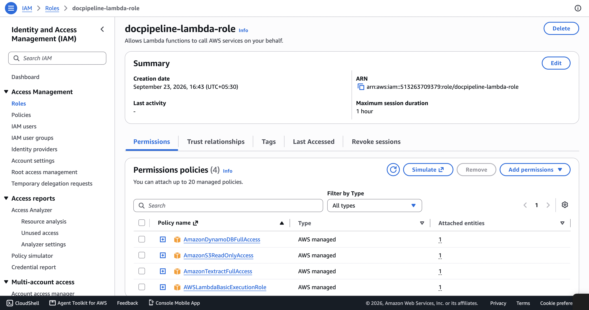

---

## 5. Lambda Functions

Three Lambda functions were created:

1. Presigned URL generation
2. Document processing
3. Results retrieval

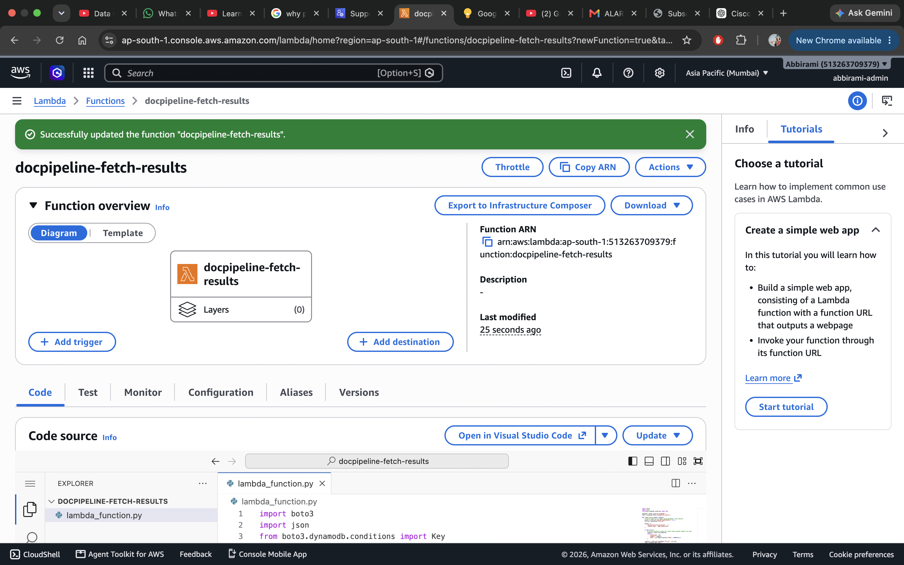

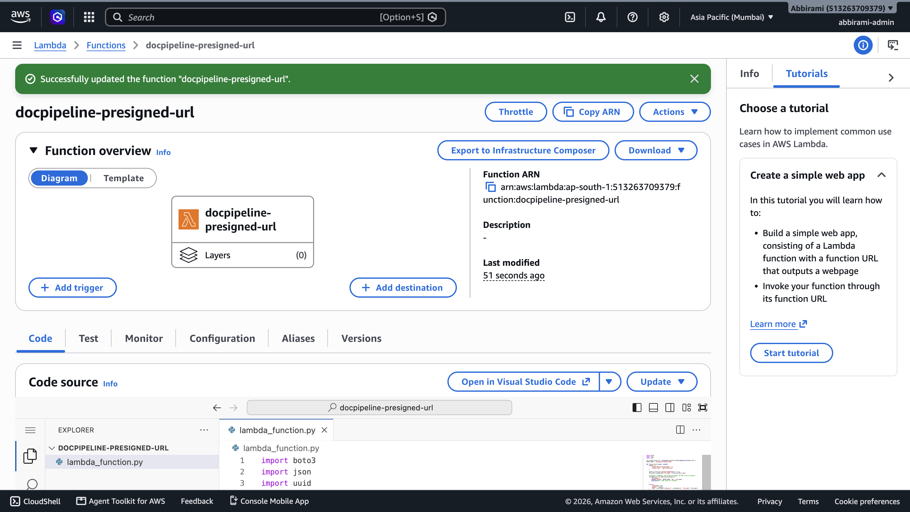

---

## 6. Textract Subscription Issue

During testing, the Textract API returned:

```text
SubscriptionRequiredException
```
---

# Infrastructure as Code

The complete AWS infrastructure is also defined using Terraform, so the entire stack can be provisioned or destroyed with a single command rather than manually creating every resource through the AWS Console.

### Commands

​```bash
terraform init      # download provider plugins
terraform plan       # preview what will be created
terraform apply      # provision the full stack
terraform destroy    # tear it all down cleanly
​```
​### Deployment Verification

The Terraform configuration was deployed independently (separate from the original console-built version) and tested end-to-end to confirm it reproduces the same working pipeline:

​```text
Apply complete! Resources: 32 added, 0 changed, 0 destroyed.

Outputs:
api_invoke_url       = "https://mcuaq825kk.execute-api.ap-south-1.amazonaws.com"
frontend_website_url = "docpipeline-frontend-2026.s3-website.ap-south-1.amazonaws.com"
dynamodb_table_name  = "docpipeline-results"
uploads_bucket_name  = "docpipeline-uploads-2026"
​```

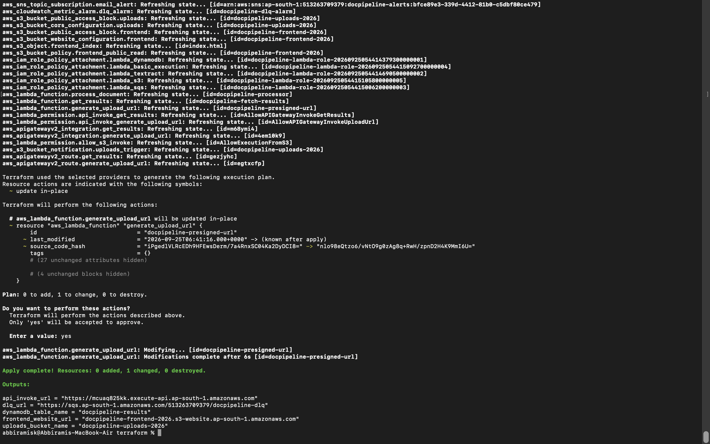

A file was then uploaded through the Terraform-deployed frontend and confirmed to process successfully end-to-end:

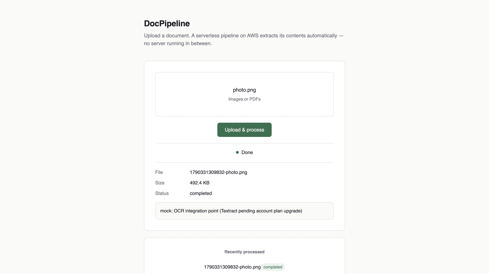
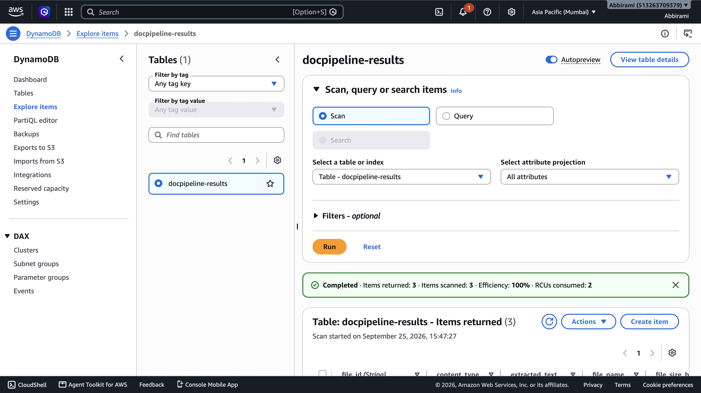
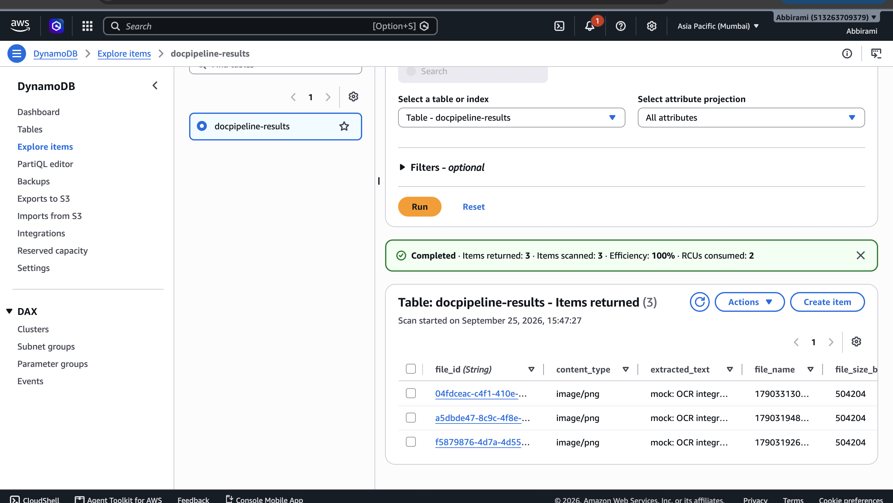
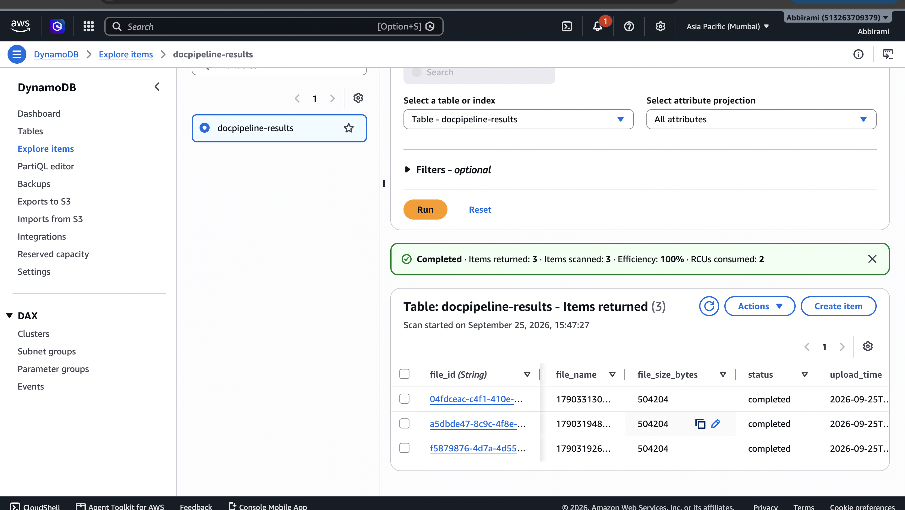

### A bug found only in the Terraform version

Resolved a Terraform-specific S3 upload issue where presigned URLs returned a 307 Temporary Redirect due to regional endpoint handling, causing browser CORS failures. Fixed by configuring the S3 client to use the ap-south-1 regional endpoint.
---

# Project Structure

```text
serverless-document-pipeline/
│
├── README.md
│
├── frontend/
│   └── index.html
│
├── lambda/
│   ├── generate_upload_url/
│   │   └── lambda_function.py
│   │
│   ├── process_document/
│   │   └── lambda_function.py
│   │
│   └── get_results/
│       └── lambda_function.py
│
├── terraform/
│   ├── README.md
│   ├── provider.tf
│   ├── variables.tf
│   ├── s3.tf
│   ├── dynamodb.tf
│   ├── iam.tf
│   ├── lambda.tf
│   ├── api_gateway.tf
│   ├── sqs_cloudwatch.tf
│   ├── outputs.tf
│   ├── .gitignore
│   └── lambda/
│       ├── generate_upload_url/lambda_function.py
│       ├── process_document/lambda_function.py
│       └── get_results/lambda_function.py
│
└── screenshots/
    ├── upload-demo.mov
    ├── iam-user.png
    ├── buckets-creation.png
    ├── dynamodb-table-1.png
    ├── dynamodb-table-2.png
    ├── role-creation.png
    ├── lambda-creation-1.png
    ├── lambda-creation-2.png
    ├── subscription.png
    ├── api.png
    ├── sqs-alert.png
    ├── dlq-test.png
    ├── alarm.png
    ├── email-alert.png
    ├── upload-result-1.png
    ├── upload-result-2.png
    ├── cloudwatch-logs-1.png
    ├── cloudwatch-logs-2.png
    ├── cloudwatch-logs-3.png
    ├── billing.png
    ├── terraform-apply.png
    ├── terraform-upload-result.png
    ├── terraform-dynamodb-1.png
    ├── terraform-dynamodb-2.png
    └── terraform-dynamodb-3.png
```
---

# Deployment

The project was deployed and tested using AWS services. The infrastructure was initially configured through the AWS Console and is also defined using Terraform for Infrastructure as Code.

### AWS Deployment

The main AWS resources configured for the project include:

- Amazon S3
- AWS Lambda
- Amazon DynamoDB
- Amazon API Gateway
- Amazon SQS
- Amazon CloudWatch
- AWS IAM

The frontend was uploaded to the S3 frontend bucket and accessed through the configured S3 static website endpoint.

### Infrastructure as Code

See the [Infrastructure as Code](#infrastructure-as-code) section above for full Terraform deployment details and verification.

# Testing

The pipeline was tested at multiple levels to verify both normal processing and failure handling.

### Functional Testing

The following workflow was tested end-to-end:

- File upload through the frontend
- S3 object creation
- S3-triggered Lambda execution
- DynamoDB result storage
- API-based result retrieval
- Frontend result display

### Failure Path Testing

The failure-handling workflow was deliberately tested by introducing a DynamoDB configuration error in the document-processing Lambda.

The test verified that:

1. The Lambda execution failed.
2. The failed event was moved to the SQS dead-letter queue.
3. CloudWatch detected the DLQ activity.
4. The CloudWatch alarm entered the `In alarm` state.
5. An email notification was received.

### Monitoring

CloudWatch Logs were used to:

- Verify Lambda executions
- Check successful processing
- Investigate errors
- Confirm the failure-handling workflow

This testing verified both the normal document-processing path and the error-handling path.

---

# Cost

The project was developed and tested using AWS services with the goal of keeping the infrastructure within a low-cost range.

The total AWS spend recorded after development and testing was:

**Under $1**

The project uses serverless and managed services such as Lambda, S3, DynamoDB, API Gateway, SQS, and CloudWatch instead of maintaining an always-running EC2 instance.

After completing development and testing, the AWS resources were removed through the AWS Console to avoid unnecessary ongoing charges.

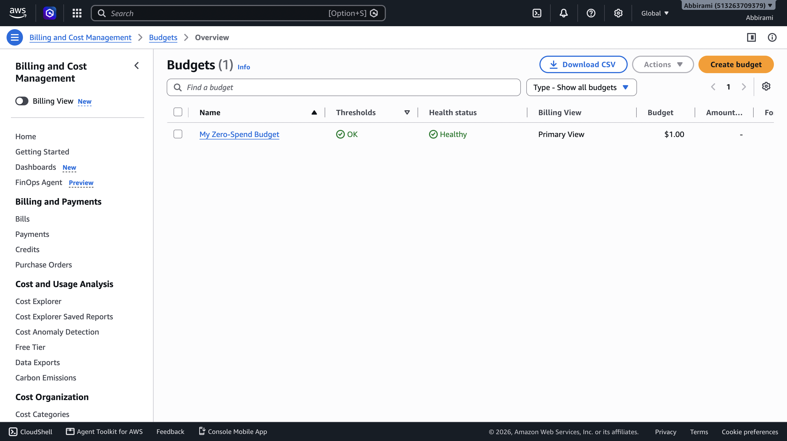

---

# Current Limitation

The Amazon Textract integration is currently represented by a mock response because the AWS account used during development had a service-plan restriction that prevented direct Textract API usage.

The integration point is already implemented in the document-processing Lambda.

The current implementation uses a placeholder response:

```python
extracted_text = "mock: OCR integration point (Textract pending account plan upgrade)"
```
---

# Future Improvements

Possible extensions to the project include:

- Enable the live Amazon Textract integration once the required account access is available.
- Support additional document formats.
- Add authentication for frontend users.
- Add document processing status tracking.
- Add CloudWatch dashboards and additional metrics.
- Store larger processing results separately in S3.
- Add CI/CD deployment for Terraform and Lambda functions.

---

# Key Cloud Concepts Demonstrated

- Serverless Architecture
- Event-Driven Architecture
- AWS Lambda
- Amazon S3
- Amazon DynamoDB
- Amazon API Gateway
- Amazon SQS
- Amazon CloudWatch
- AWS IAM
- Infrastructure as Code
- Terraform
- Presigned URLs
- S3 Event Triggers
- Dead-Letter Queues
- Error Handling and Monitoring
- Python-based AWS Lambda Development


---

# Conclusion

This project demonstrates a complete serverless document-processing workflow using AWS managed services.

The system combines storage, serverless compute, API integration, database storage, monitoring, failure handling, and Infrastructure as Code into a single event-driven architecture.

The project also demonstrates practical cloud engineering concepts including secure file uploads, event-driven processing, error handling, monitoring, and Terraform-based infrastructure management.

After development and testing, the AWS resources were removed through the AWS Console to avoid unnecessary ongoing charges.
